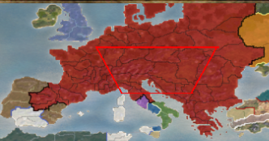

import { Tabs, TabItem, Aside } from '@astrojs/starlight/components';

REX and M2EX include a number of extra configuration options compared with the vanilla games.

## Main Menu Options
#### Graphics Settings
New options are available in the graphics options menu for some graphics settings (highlighted red in M2EX). For example the "Extreme" settings.

These push the graphical detail far beyond what the games were capable of before, *but can come at a significant cost to performance*. You can test these out and see what your PC can handle.

#### Modern WASD Control Scheme
In **Options** > **Keyboard Settings**, click the right arrow to change from "Total War Style Setup" to "FPS Style Setup".

## In-game options
While playing, you will find a number of new gameplay and graphical configuration options.

#### Unit Movement Run Mode
While playing, go to **Options** > **Game Options**.

This controls whether units walk (as in vanilla) or run. By default, this is set so they run when you drag out a formation.

#### New Camera and Tilt Options
While playing, go to **Options** > **Camera Options**.

By default, the **Camera Mode** is set to RTS Camera, which is REX/M2EX's much improved camera. 

Enable **No Camera Tilt** if you want to disable tilting when you zoom in and out.

#### Unit cards and icons on highlight
While playing, go to **Options** > **Video Options**.

These two options determine if you see little icons and unit cards when you hold the highlight key (this defaults to space bar).

#### Unit Silhouettes
While playing, go to **Options** > **Video Options**.

This controls whether blue/red silhouettes of friendly and enemy units appear through obstacles, such as trees or terrain, enhancing visibility.

#### Range Indicator
While playing, go to **Options** > **Video Options**.

This controls whether a range circle is drawn around selected ranged units, showing how far they can shoot (depending on terrain etc).

This indicator can be customised further in the [Advanced Configuration Files](#advanced-configuration-files)

#### Blood Pools
While playing, go to **Options** > **Video Options**.

This controls whether pools of blood are created around dead soldiers.

## Advanced Configuration Files
Certain options are not currently available to tweak within the game. These can be found in text files in the `data` folder, such as: `descr_ex.txt` and `descr_caps_ex.txt`.

Note that these files will be overwritten every time you install a new release, so it's recommended to keep a note/backup of the values you changed and re-add them after upgrading to a new version.

Certain especially useful options are noted below (but the files have comments to explain each setting and what it does):

#### descr_ex
This section allows you to customise the look of the range indicators:
````
;;;;;;;;;;;;;;;;;;;;;;;;;;;;;;;;;;;;;;;;;;;;;;;;;;;;;
; Battle range indicator
;;;;;;;;;;;;;;;;;;;;;;;;;;;;;;;;;;;;;;;;;;;;;;;;;;;;;
````

A more subtle red range indicator configuration (closer to other Total War games) would be:
```
; Disc colour, r g b (0-255)
range_indicator_colour 255 0 0

; Alpha at the edge (0-1)
range_indicator_peak_alpha 1

; Alpha of the inside (0-1)
range_indicator_floor_alpha 0

; Inward fade width from the edge as a fraction of the radius (0-1)
range_indicator_falloff 0.015

; Outer-edge softness; small = crisp (0-1)
range_indicator_fuzz 0.008
```

`blood_pool_limit` allows you to set maximum [blood pools](#blood-pools) on the battlefield.

`corpse_limit` allows you to set how many corpses are allowed before the oldest ones are removed for performance reasons.

`show_unit_card_always` allows you to set [unit cards and icons](#unit-cards-and-icons-on-highlight) to appear at all times (and there are other options next to it allowing further customisation).

#### descr_caps_ex
`fog_of_war_shroud` - Allows you to change whether fog of war for unexplored areas in REX is `black` or `vanilla` (grey, as in the original game).

`faction_unlock` - Allows you to change whether all factions are unlocked for the campaign straight away or whether you want to return to the vanilla unlocking mechanics.

#### descr_sm_factions
You can use this file to add internal province borders on the campaign mini-map, by adding a `tertiary_colour` to each faction. 


For example:
```
tertiary_colour                red 0, green 0, blue 0
```

#### Visibility of arrows
REX/M2EX makes arrows brighter than they are in vanilla by default.

`descr_projectile_new.txt` (REX) and `descr_flaming_projectiles.txt` (M2EX) allow you to customise this.

An example from the REX file for the parameters:

```
;<far> <mid> <length_cap> <whiten_cap> <whiten_gain>
distance_visibility    0.05 0.10 2.0 0.19 0.0007
```

If you would like to revert the look back to vanilla, set the "distance_visibility" lines in the files to:

`distance_visibility 0 0 1 0 0`
