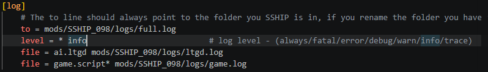

import { Tabs, TabItem, Aside, FileTree } from '@astrojs/starlight/components';

<Aside>Before reporting an issue, use the troubleshooting checklists below.</Aside>

#### Troubleshooting Checklist
- Make sure you have exactly followed the [Installation guide](../installation/) on a clean installation of the game(s).
- Check you are using the latest **Stable** release. Not a Test release.
- Check you have installed REX/M2EX in the main game folder (not the `/mods` folder).
- If you are running your game in any other language than English - try the latter and see if it helps.
- Check your game files have not been flagged as a false positive by an antivirus. For testing purposes only, you can check if disabling smart screen or UAC helps.

#### Troubleshooting Checklist - Mods
If you are running mods, *also* check the below:
- Make sure you have carefully followed the [Running Mods](../running-mods/) guide.
- Check your mod running methods for any typos (happens to the best of us) and that they're pointing correctly to REX/M2EX.
- Check the [mod patches](https://discord.com/channels/1456826444360581235/1501929819204616363) channel and apply any fixes for your mod.
- Check if you have installed a mod requiring installation outside the `/mods` folder (e.g. into the main directory) - if yes then M2EX won't work. If you want to play with M2EX with some other mod, you may need to delete the game directory and re-install it.
- Have non-REX/M2EX users reported bugs with this mod in the mod's forum or on Discord? Some mods may have issues even when played with the vanilla game, and it might not be an issue with REX/M2EX.

#### "My game is running poorly" checklist
- When you have both an integrated GPU and a dedicated GPU, ensure the latter is being used.
- Ensure you are not using any "Extreme" graphics settings.
- Reduce or disable MSAA, as this is very demanding.
- If playing a mod, ensure that logging in the mod's configuration file is set to `info` instead of `trace` (look for `.cfg` in the mod directory):

- Obviously if you have 100 Chrome tabs open, this will have an effect on performance. Try closing any other demanding applications.
- Sometimes using V-Sync or capping the FPS can help the feeling of an unsteady frame rate (and take some strain off your PC).

#### I have no sound in battles
If you are experiencing no sound during the battle - make sure it's not you hitting the ALT + S hotkey which the game uses for muting (including in vanilla).

## Reporting issues
If you have gone through the troubleshooting checklists and nothing helped, check the steps below to prepare a bug report:

#### Logs
Get the logs right away after the bug happens so you can attach them later. You need to send logs for *all issues*, even if your game didn't crash to desktop.

- Normal logs are in the main folder, called `system.log.txt`. Grab this file *immediately*, as it's overwritten every time you run the game.
- For crashes only: Crash logs are saved in your game directory in the `reports` folder. Please send the latest `.txt` file only, not the `.dmp` files, alongside the `system.log.txt`.

If you do not have any reports or a `system.log.txt`, at least try to show where you crashed, error window contents and if possible send a save file.

#### Preparing a report
Describe what is wrong and when it happens (in preparation for posting). A video + a message describing it would be the best option, but you can upload a screenshot and/or simply just write a text description. Be precise and give as much detail as possible. If you got a error message – show it! 

Before you report, if at all possible, try replicating the issue. For example, if you have a button missing in your campaign, start a new one and see if the bug persists. Or try exiting and going back into the game on the same save file/try a different save/try loading it again. 

#### Posting your report
Issues will often get lost in the general chat channels, so you should post them in:

- [⁠help-troubleshooting](https://discord.com/channels/1456826444360581235/1497355400402440355) – for any hard errors, crashes, very low FPS, options (camera etc.) problems and problems prohibiting you from playing the game and other emergencies that need a quick response. Sometimes you might be asked to copy that report and make a fresh post in the issues channel, or you might do that on your own if no one answers. 

- [⁠issues](https://discord.com/channels/1456826444360581235/1471288433816371282) – for anything else including things that aren't an emergency, bugged or broken functionality (e.g. missing portraits, units behaving in the wrong way) etc. The channel settings won't let you post there without proper tags, like vanilla + REX or modded + M2EX. Sometimes you need to mind what was already fixed or is it vanilla behaviour that belongs to suggestions channels.

A checklist for your report:
- Tag the post with which game this is
- Tag the post with whether it's vanilla or modded
- Specify which version of REX/M2EX you're using
- If using a mod, specify the mod and which version of it you're using. Ideally, check if the issue occurs in vanilla too.
- Detailed description of the issue and when it happened
- Supporting screenshots or videos
- Upload `system.log.txt`. If it's a very large file and Discord won't let you upload it, put it in a .zip file first. 
- Upload crash logs, if applicable

An example of a post in both channels could be, "Hi. I got an error while trying to recruit mercenaries. It happens when I click the 'pay' button. No error is visible on the screen. It happens all the time and in other campaigns that I am playing. Here is a video/screenshot/further text explanation. I've attached the logs. M2EX 21/06 version. I am running the mod SSHIP, version 0.98. This bug does not happen in vanilla."

Sometimes you will be asked for further actions after your initial post.

